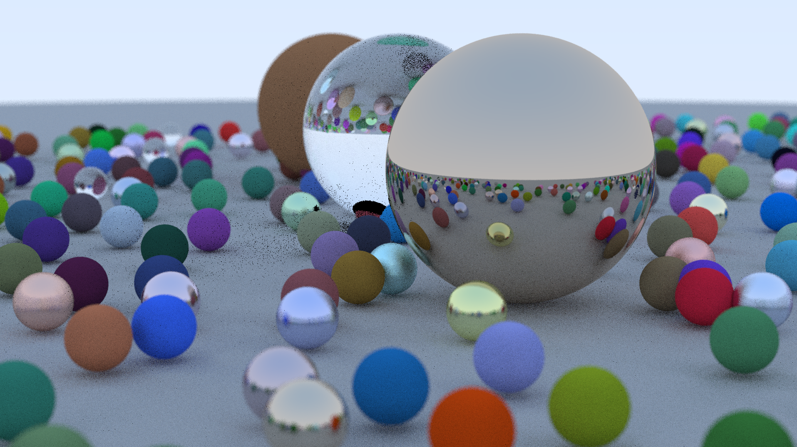

# Odin Ray Tracer


> Image rendered with 16 samples

A simple CPU ray tracer written in Odin following the [Ray Tracing in One Weekend](https://raytracing.github.io/) book.

## Features
- Multithreaded
- Diffuse lighting
- Materials
  - Lambertian
  - Metal
  - Dielectric

## Running
Requirements:
- Odin compiler

Build:
```bash
odin build src -o:speed -out:raytracer
```

Usage:
```bash
./raytracer <width> <height> <samples>
```